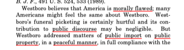
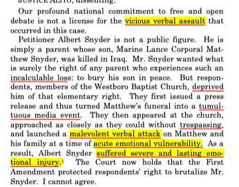

# Measuring Judge Ideology 

Education Data Science Practicum Spring 2019

Project Started: 1/30/2019  
Updated: 2/23/2019

### Purpose:
There are lots of models that can be used to estimate ideal points of judges (i.e. Poole and Rosenthal, Martin-Quinn, Clinton, etc). These models use mostly voting records of the judges. The purpose of this study is to try ideal-point modeling using the text of opinions instead of voting behavior. The subjects of the study are federal judges in the Appellate Courts of the United States (i.e. 1st Circuit Court of Appeals).    

### Data:
- [Court Listener](https://www.courtlistener.com/api/bulk-info/)
- [Duke](https://law.duke.edu/lib/facultyservices/empirical/links/courts/)
- [The Judicial Research Initiative](http://artsandsciences.sc.edu/poli/juri/appct.htm)

### Challenge:

Text analysis of judge decisions may be able to identify differences in style, but differences in ideology are much too subtle. Ash and Chen show that even after de-meaning for year, topic, and circuit, there are no discernible differences between the vector representations of democratic vs republican judges. Why? One reason may be that  legal language is jargony and typically avoids coloquialisms (e.g. in Congress, members use colloquial speech in floor speeches such as "death tax", "estate tax", "fake news", "alternative facts", "pro-life", "anti-choice"), as discussed in [538 article](https://fivethirtyeight.com/features/how-conservative-is-brett-kavanaugh/). In a judge's opinion, the judge provides the fact pattern, explains the relevant laws, explains the relevant precedents, then finally proceeds to legal analysis. Judges sometimes conclude with a commentary, which can often be more colorful than dry legal analysis. So the earlier parts of an opinion have little to no signal since the judge is simply stating facts.  

But it may still be possible...

As an example of why I think the task of modeling judge ideology using text is possible, consider Snyder vs. Phelps (2011): 

Westboro church members picketed with egregious homopphobic signs at the funeral service of Marine Lance Corporal Matthew Snyder. Roberts states that there are "special protections" for speech regarding public issues that takes place on public land:

Alito dissents, stating that free speech is not a license to inflict harm. Here's a passage:

Roberts and Alito (both "conservative") disagree on the meaning and effect of the first amendment. Roberts emphasizes the importance of protecting **_public_** speech while Alito sees this case as an instance of hate speech and a "malevolent verbal **attack**" causing "severe and lasting emotional **injury**". 

### Analysis:

#### Part one:

Some things to watch out for include **era-effects**, **topic-effects** and **circuit effects**.

1. Start with one circuit court
2. Learn to implement doc2vec using "fastTextR", "textTinyR"
3. The idea is to apply this onto all federal appellate court opinions
4. Then, de-mean by **year**, **topic**, and **circuit**

Problem:
- "Year" and "circuit" are in the data. Can I get "topic" from somwhere or do I need to model it?

#### Part two:

Now that I know I can implenent vector representations of these documents, need to clean text.

1. Identify the judge who wrote the opinion (Metadata not available for all federal appellate court cases)
2. Identify dissent, concurrence, per curiam

